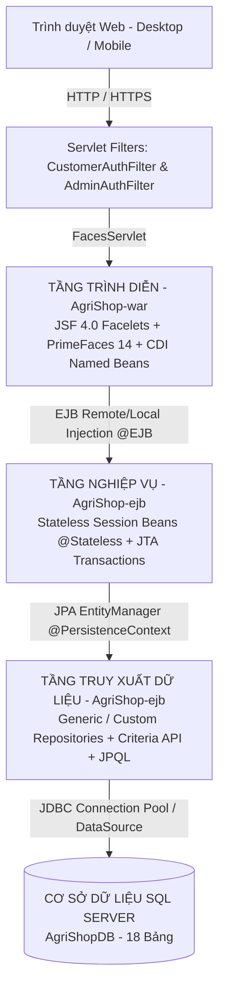

# SỔ TAY TOÀN TẬP KIẾN TRÚC HỆ THỐNG, MÃ NGUỒN VÀ PHÒNG THỦ VẤN ĐÁP ĐỒ ÁN AGRISHOP
> **Tài liệu đặc biệt:** Cẩm nang chi tiết từng tính năng, chỉ dẫn chính xác file mã nguồn, số dòng, ý nghĩa kỹ thuật và bộ câu hỏi vấn đáp phục vụ bảo vệ đồ án cuối môn Jakarta EE / Java EE.

---

## MỤC LỤC TỔNG QUAN

- [PHẦN I: TỔNG QUAN KIẾN TRÚC TOÀN DỰ ÁN (ENTERPRISE ARCHITECTURE)](#phần-i-tổng-quan-kiến-trúc-toàn-dự-án-enterprise-architecture)
  - [1. Mô hình 3 tầng chuẩn Doanh nghiệp (3-Tier Enterprise)](#1-mô-hình-3-tầng-chuẩn-doanh-nghiệp-3-tier-enterprise)
  - [2. Vòng đời xử lý một Request trong hệ thống](#2-vòng-đời-xử-lý-một-request-trong-hệ-thống)
  - [3. Cấu trúc thư mục mã nguồn và vai trò từng Module](#3-cấu-trúc-thư-mục-mã-nguồn-và-vai-trò-từng-module)
- [PHẦN II: DANH MỤC CHI TIẾT TỪNG TÍNH NĂNG & CHỈ DẪN CODE CHÍNH XÁC](#phần-ii-danh-mục-chi-tiết-từng-tính-năng--chỉ-dẫn-code-chính-xác)
  - [A. Nhóm Xác thực, Phân quyền & Bảo mật (Auth & Security)](#a-nhóm-xác-thực-phân-quyền--bảo-mật-auth--security)
    - [1. Đăng ký tài khoản & Kích hoạt Email](#1-đăng-ký-tài-khoản--kích-hoạt-email)
    - [2. Đăng nhập & Chống tấn công Brute-Force](#2-đăng-nhập--chống-tấn-công-brute-force)
    - [3. Xác thực 2 bước (2FA TOTP) cho Quản trị viên](#3-xác-thực-2-bước-2fa-totp-cho-quản-trị-viên)
    - [4. Bộ lọc bảo mật Servlet Filters (Customer vs Admin)](#4-bộ-lọc-bảo-mật-servlet-filters-customer-vs-admin)
    - [5. Quên mật khẩu & Đặt lại mật khẩu qua Token](#5-quên-mật-khẩu--đặt-lại-mật-khẩu-qua-token)
  - [B. Nhóm Tính năng Khách hàng & Cửa hàng (Storefront)](#b-nhóm-tính-năng-khách-hàng--cửa-hàng-storefront)
    - [6. Trang chủ nông sản & Khám phá sản phẩm](#6-trang-chủ-nông-sản--khám-phá-sản-phẩm)
    - [7. Bộ lọc & Tìm kiếm sản phẩm đa tiêu chí](#7-bộ-lọc--tìm-kiếm-sản-phẩm-đa-tiêu-chí)
    - [8. Chi tiết sản phẩm, Bộ sưu tập ảnh & Trạng thái kho](#8-chi-tiết-sản-phẩm-bộ-sưu-tập-ảnh--trạng-thái-kho)
    - [9. Hệ thống Đánh giá Review 5 sao & Phản hồi Admin](#9-hệ-thống-đánh-giá-review-5-sao--phản-hồi-admin)
    - [10. Danh sách sản phẩm Yêu thích (Wishlist)](#10-danh-sách-sản-phẩm-yêu-thích-wishlist)
    - [11. Giỏ hàng Realtime & Gộp giỏ hàng Khách vãng lai](#11-giỏ-hàng-realtime--gộp-giỏ-hàng-khách-vãng-lai)
    - [12. Đặt hàng & Khóa hàng tồn chống xung đột kho](#12-đặt-hàng--khóa-hàng-tồn-chống-xung-đột-kho)
    - [13. Cổng thanh toán mô phỏng VNPay Sandbox & VietQR](#13-cổng-thanh-toán-mô-phỏng-vnpay-sandbox--vietqr)
    - [14. Lịch sử đơn hàng & Quy trình Yêu cầu Hủy đơn](#14-lịch-sử-đơn-hàng--quy-trình-yêu-cầu-hủy-đơn)
    - [15. Quản lý Hồ sơ cá nhân & Đổi mật khẩu](#15-quản-lý-hồ-sơ-cá-nhân--đổi-mật-khẩu)
  - [C. Nhóm Quản trị Website & Chuỗi cung ứng (Back-Office)](#c-nhóm-quản-trị-website--chuỗi-cung-ứng-back-office)
    - [16. Bảng điều khiển Tổng quan (Dashboard & Analytics)](#16-bảng-điều-khiển-tổng-quan-dashboard--analytics)
    - [17. Quản lý Danh mục hàng hóa (Categories CRUD)](#17-quản-lý-danh-mục-hàng-hóa-categories-crud)
    - [18. Quản lý Sản phẩm & Upload ảnh (Products CRUD)](#18-quản-lý-sản-phẩm--upload-ảnh-products-crud)
    - [19. Quản lý Kho hàng, Nhập hàng & Tồn kho khả dụng](#19-quản-lý-kho-hàng-nhập-hàng--tồn-kho-khả-dụng)
    - [20. Lịch sử Biến động Giao dịch Kho (Stock Transactions)](#20-lịch-sử-biến-động-giao-dịch-kho-stock-transactions)
    - [21. Quản lý Đối tác Nhà cung cấp & Đánh giá Hiệu suất](#21-quản-lý-đối-tác-nhà-cung-cấp--đánh-giá-hiệu-suất)
    - [22. Quản trị Đơn hàng, Xác nhận, Tự động Hoàn kho & Hoàn tiền](#22-quản-trị-đơn-hàng-xác-nhận-tự-động-hoàn-kho--hoàn-tiền)
    - [23. Quản lý Khách hàng & Lịch sử Mua sắm](#23-quản-lý-khách-hàng--lịch-sử-mua-sắm)
    - [24. Quản lý Mã giảm giá (Coupons CRUD)](#24-quản-lý-mã-giảm-giá-coupons-crud)
    - [25. Quản lý Người dùng nội bộ & Phân quyền Role](#25-quản-lý-người-dùng-nội-bộ--phân-quyền-role)
    - [26. Nhật ký Kiểm toán Hệ thống (Audit Logs)](#26-nhật-ký-kiểm-toán-hệ-thống-audit-logs)
    - [27. Cấu hình Tham số Hệ thống động (System Settings)](#27-cấu-hình-tham-số-hệ-thống-động-system-settings)
- [PHẦN III: 7 TÍNH NĂNG ĐẶC BIỆT & GIÁ TRỊ KỸ THUẬT CAO (KEY HIGHLIGHTS)](#phần-iii-7-tính-năng-đặc-biệt--giá-trị-kỹ-thuật-cao-key-highlights)
- [PHẦN IV: BỘ 25 CÂU HỎI VÀ CÂU TRẢ LỜI VẤN ĐÁP BẢO VỆ ĐỒ ÁN (DEFENSE FAQ)](#phần-iv-bộ-25-câu-hỏi-và-câu-trả-lời-vấn-đáp-bảo-vệ-đồ-án-defense-faq)

---

## PHẦN I: TỔNG QUAN KIẾN TRÚC TOÀN DỰ ÁN (ENTERPRISE ARCHITECTURE)

### 1. Mô hình 3 tầng chuẩn Doanh nghiệp (3-Tier Enterprise)

Dự án **AgriShop** được xây dựng tuân thủ kiến trúc phân tầng kinh điển trong Jakarta EE (Java EE), tách biệt hoàn toàn giữa giao diện, logic xử lý nghiệp vụ và truy xuất cơ sở dữ liệu:



- **Tầng Trình Diễn (Presentation Layer - `AgriShop-war`):**
  - Sử dụng chuẩn **Jakarta Faces 4.0** với bộ thư viện giao diện cao cấp **PrimeFaces 14**.
  - Các Managed Bean được chú thích `@Named` và quản lý theo Scope phù hợp:
    - `@SessionScoped`: `LoginBean`, `CartBean` (lưu trữ phiên làm việc của người dùng).
    - `@ViewScoped`: `ProductDetailBean`, `OrderManagementBean`, `InventoryBean`, `CheckoutBean` (duy trì trạng thái dữ liệu trong suốt vòng đời của trang, tránh tải lại không cần thiết).
    - `@RequestScoped`: `RegisterBean`, `ContactBean` (xử lý nhanh các form yêu cầu đơn lẻ).
- **Tầng Nghiệp Vụ (Business Logic Layer - `AgriShop-ejb`):**
  - Xây dựng bằng các **Stateless Session Beans (`@Stateless`)**.
  - Mỗi Bean triển khai một Local Interface (`@Local`), giúp loose coupling (giảm phụ thuộc chặt) giữa các module.
  - Quản lý giao dịch tự động bằng container (Container-Managed Transactions - CMT) với `@TransactionAttribute(TransactionAttributeType.REQUIRED)`. Mọi lỗi dạng `RuntimeException` hoặc `Exception` được đánh dấu rollback tự động bảo toàn tính toàn vẹn dữ liệu.
- **Tầng Truy Xuất Dữ Liệu (Data Access Layer - `AgriShop-ejb`):**
  - Sử dụng **Jakarta Persistence (JPA 3.1)** thông qua `EntityManager`.
  - Các Repository đóng gói các câu truy vấn JPQL phức tạp, tối ưu hóa N+1 query bằng `JOIN FETCH`, và hỗ trợ phân trang động bằng `CriteriaBuilder` / `CriteriaQuery`.

---

### 2. Vòng đời xử lý một Request trong hệ thống

Mỗi khi người dùng tương tác trên giao diện, chuỗi xử lý diễn ra như sau:
1. **Client Request:** Trình duyệt gửi HTTP GET/POST tới máy chủ GlassFish 8.
2. **Security Filtering:** Request đi qua `CustomerAuthFilter` hoặc `AdminAuthFilter` để kiểm tra phiên đăng nhập và quyền truy cập (`role`). Nếu vi phạm, trả về redirect ngay lập tức.
3. **JSF Lifecycle (6 Phases):**
   - *Phase 1 (Restore View):* Tái tạo cây giao diện UIViewRoot.
   - *Phase 2 (Apply Request Values):* Gán các giá trị từ request vào components.
   - *Phase 3 (Process Validations):* Chạy validation client và Bean Validation (`f:validateRegex`, `required`, ...). Nếu có lỗi, chuyển thẳng sang Phase 6 để render thông báo.
   - *Phase 4 (Update Model Values):* Đẩy dữ liệu hợp lệ vào thuộc tính của Managed Bean.
   - *Phase 5 (Invoke Application):* Thực thi phương thức Action (ví dụ: `checkoutBean.placeOrder()`). Trong method này, Bean gọi sang EJB Service tương ứng qua interface EJB.
   - *Phase 6 (Render Response):* Chuyển đổi trạng thái bean thành mã HTML và trả về trình duyệt.

---

### 3. Cấu trúc thư mục mã nguồn và vai trò từng Module

```text
AgriShop/
├── AgriShop-ejb/                             (Module EJB - Xử lý nghiệp vụ & CSDL)
│   └── src/java/com/agrishop/
│       ├── dto/                              (Data Transfer Objects - Truyền tải dữ liệu an toàn)
│       ├── entity/                           (18 Thực thể JPA ánh xạ CSDL)
│       ├── exception/                        (BusinessException tùy chỉnh xử lý lỗi nghiệp vụ)
│       ├── payment/                          (Interface & Cổng thanh toán VnPayPaymentGateway)
│       ├── repository/                       (Tầng DAO/Repository truy vấn EntityManager)
│       ├── service/                          (Các EJB Stateless Service cài đặt nghiệp vụ)
│       └── util/                             (Tiện ích: PasswordUtils SHA-256, TotpUtils 2FA)
├── AgriShop-war/                             (Module WAR - Giao diện & Điều khiển)
│   ├── src/java/com/agrishop/web/
│   │   ├── bean/                             (Các JSF Managed Beans điều khiển giao diện)
│   │   ├── converter/                        (Custom JSF Converters cho AutoComplete & Dropdown)
│   │   ├── filter/                           (CustomerAuthFilter & AdminAuthFilter)
│   │   ├── servlet/                          (SePayWebhookServlet, SitemapServlet)
│   │   └── util/                             (FileUploadUtil xử lý upload ảnh)
│   └── web/
│       ├── admin/                            (Toàn bộ 13 trang quản trị Admin / Staff)
│       ├── assets/                           (Hình ảnh sản phẩm, avatar người dùng, icon)
│       ├── resources/css/                    (storefront.css, admin.css, theme.css)
│       ├── WEB-INF/components/               (productCard.xhtml component tái sử dụng)
│       ├── WEB-INF/templates/                (adminTemplate.xhtml, customerTemplate.xhtml)
│       └── *.xhtml                           (Các trang Storefront: index, store, cart, checkout...)
└── AgriShopDB.sql                            (Script CSDL SQL Server 18 bảng & Dữ liệu mẫu)
```

---

## PHẦN II: DANH MỤC CHI TIẾT TỪNG TÍNH NĂNG & CHỈ DẪN CODE CHÍNH XÁC

---

### A. NHÓM XÁC THỰC, PHÂN QUYỀN & BẢO MẬT (AUTH & SECURITY)

#### 1. Đăng ký tài khoản & Kích hoạt Email
- **Mục đích nghiệp vụ:** Cho phép khách hàng mới tạo tài khoản trên hệ thống, xác thực dữ liệu chặt chẽ và kích hoạt tài khoản qua mã token bảo mật.
- **Vị trí file & Dòng code:**
  - Form UI: [`AgriShop-war/web/register.xhtml`](file:///d:/TAN_FILE/Study/CUSC/JakartaEE/ProjectFinal/AgriShop/AgriShop-war/web/register.xhtml)
  - Controller: [`RegisterBean.java`](file:///d:/TAN_FILE/Study/CUSC/JakartaEE/ProjectFinal/AgriShop/AgriShop-war/src/java/com/agrishop/web/bean/RegisterBean.java) (Method `register()`, dòng 48–110).
  - Service: [`UserService.java`](file:///d:/TAN_FILE/Study/CUSC/JakartaEE/ProjectFinal/AgriShop/AgriShop-ejb/src/java/com/agrishop/service/UserService.java) (Method `registerUser()`, dòng 82–135).
  - Tiện ích mã hóa: [`PasswordUtils.java`](file:///d:/TAN_FILE/Study/CUSC/JakartaEE/ProjectFinal/AgriShop/AgriShop-ejb/src/java/com/agrishop/util/PasswordUtils.java) (Method `hashPassword()`, dòng 14–32).
- **Ý nghĩa kỹ thuật then chốt:**
  - `UserService.java` kiểm tra username và email đã tồn tại chưa: nếu có, ném `BusinessException("Tên đăng nhập hoặc Email đã tồn tại")`.
  - Mật khẩu được băm một chiều với thuật toán `SHA-256` trước khi lưu vào cột `password_hash` của bảng `Users`.
  - Tự động sinh mã kích hoạt UUID lưu trong bảng `UserTokens` với thời hạn 24 giờ.

#### 2. Đăng nhập & Chống tấn công Brute-Force
- **Mục đích nghiệp vụ:** Xác thực người dùng, bảo vệ tài khoản khỏi tấn công đoán mật khẩu liên tục, phân quyền điều hướng đúng vai trò.
- **Vị trí file & Dòng code:**
  - Form UI: [`AgriShop-war/web/login.xhtml`](file:///d:/TAN_FILE/Study/CUSC/JakartaEE/ProjectFinal/AgriShop/AgriShop-war/web/login.xhtml)
  - Controller: [`LoginBean.java`](file:///d:/TAN_FILE/Study/CUSC/JakartaEE/ProjectFinal/AgriShop/AgriShop-war/src/java/com/agrishop/web/bean/LoginBean.java) (Method `login()`, dòng 52–145).
  - Service đăng nhập: [`UserService.java`](file:///d:/TAN_FILE/Study/CUSC/JakartaEE/ProjectFinal/AgriShop/AgriShop-ejb/src/java/com/agrishop/service/UserService.java) (Method `login()`, dòng 45–78).
  - Service khóa Brute-Force: [`LoginAttemptService.java`](file:///d:/TAN_FILE/Study/CUSC/JakartaEE/ProjectFinal/AgriShop/AgriShop-ejb/src/java/com/agrishop/service/LoginAttemptService.java) (Dòng 30–85).
- **Ý nghĩa kỹ thuật then chốt:**
  - *Kiểm tra Brute-Force (`LoginBean.java`, dòng 69–78):* Gọi `loginAttemptService.getRemainingLockMinutes()` theo cả Username và IP máy khách. Nếu sai quá 5 lần, tạm khóa 15 phút.
  - *Kiểm tra trạng thái (`LoginBean.java`, dòng 84–97):* Chặn tài khoản bị vô hiệu (`status == "INACTIVE"`) hoặc chưa kích hoạt email (`status == "PENDING_ACTIVATION"`).
  - *Chuyển hướng thông minh (`LoginBean.java`, dòng 106–129):*
    - Nếu là `ADMIN`: Đặt `pending2faUser` vào session, chuyển hướng bắt buộc sang `/admin-2fa.xhtml`.
    - Nếu là `STAFF`: Chuyển hướng vào trang quản lý nghiệp vụ `/admin/order.xhtml`.
    - Nếu là `CUSTOMER`: Gộp giỏ hàng vãng lai (`cartBean.mergeAfterLogin()`), tải yêu thích (`wishlistBean.loadWishlist()`) và chuyển hướng về `/index.xhtml`.

#### 3. Xác thực 2 bước (2FA TOTP) cho Quản trị viên
- **Mục đích nghiệp vụ:** Nâng cấp chuẩn bảo mật doanh nghiệp cho tài khoản Quản trị viên bằng mã OTP 6 số theo thời gian (Google Authenticator / Microsoft Authenticator).
- **Vị trí file & Dòng code:**
  - Form UI: [`AgriShop-war/web/admin-2fa.xhtml`](file:///d:/TAN_FILE/Study/CUSC/JakartaEE/ProjectFinal/AgriShop/AgriShop-war/web/admin-2fa.xhtml)
  - Controller: [`Admin2FABean.java`](file:///d:/TAN_FILE/Study/CUSC/JakartaEE/ProjectFinal/AgriShop/AgriShop-war/src/java/com/agrishop/web/bean/Admin2FABean.java) (Method `init()` dòng 29–51; Method `verify()` dòng 53–95).
  - Tiện ích TOTP: [`TotpUtils.java`](file:///d:/TAN_FILE/Study/CUSC/JakartaEE/ProjectFinal/AgriShop/AgriShop-ejb/src/java/com/agrishop/util/TotpUtils.java) (Thuật toán HMAC-SHA1 RFC 6238, Base32, dòng 20–115).
- **Ý nghĩa kỹ thuật then chốt:**
  - Nếu Admin chưa bật 2FA, hệ thống tự sinh khóa bí mật Base32 (`secretKey`) và hiển thị mã QR URL `otpauth://totp/...`.
  - Hàm `TotpUtils.verifyCode()` tính toán cửa sổ thời gian 30 giây (Time Window) với sai số cho phép ±1 time-step để xác minh mã 6 chữ số.
  - Khi xác minh thành công: Lưu cờ `session.setAttribute("admin2faVerified", true)` và cấp phiên đăng nhập chính thức vào Admin Dashboard.

#### 4. Bộ lọc bảo mật Servlet Filters (Customer vs Admin)
- **Mục đích nghiệp vụ:** Ngăn chặn tuyệt đối truy cập trái phép bằng URL, phân định ranh giới giữa Khách hàng, Nhân viên và Quản trị viên.
- **Vị trí file & Dòng code:**
  - Bộ lọc Quản trị: [`AdminAuthFilter.java`](file:///d:/TAN_FILE/Study/CUSC/JakartaEE/ProjectFinal/AgriShop/AgriShop-war/src/java/com/agrishop/web/filter/AdminAuthFilter.java) (Pattern `@WebFilter(urlPatterns = {"/admin/*"})`, dòng 33–80).
  - Bộ lọc Khách hàng: [`CustomerAuthFilter.java`](file:///d:/TAN_FILE/Study/CUSC/JakartaEE/ProjectFinal/AgriShop/AgriShop-war/src/java/com/agrishop/web/filter/CustomerAuthFilter.java) (Pattern `@WebFilter(urlPatterns = {"/*"})`, dòng 23–72).
- **Ý nghĩa kỹ thuật then chốt:**
  - `AdminAuthFilter.java` dòng 48–52: Kiểm tra cờ `admin2faVerified`. Nếu admin chưa nhập OTP, đẩy ngay về `/admin-2fa.xhtml`.
  - `AdminAuthFilter.java` dòng 58–75: Nếu role là `STAFF`, kiểm tra danh sách cấm `ADMIN_ONLY_PAGES` (như `user.xhtml`, `coupon.xhtml`, `audit-log.xhtml`). Nếu cố truy cập sẽ bị đẩy về trang đơn hàng.
  - `CustomerAuthFilter.java` dòng 59–65: Bảo vệ các trang nhạy cảm (`checkout.xhtml`, `order-history.xhtml`, `profile.xhtml`). Nếu người dùng là khách vãng lai, chuyển về `/login.xhtml`.

#### 5. Quên mật khẩu & Đặt lại mật khẩu qua Token
- **Mục đích nghiệp vụ:** Cho phép người dùng khôi phục mật khẩu thông qua mã xác nhận gửi tới email.
- **Vị trí file & Dòng code:**
  - UI: [`forgot-password.xhtml`](file:///d:/TAN_FILE/Study/CUSC/JakartaEE/ProjectFinal/AgriShop/AgriShop-war/web/forgot-password.xhtml) và [`reset-password.xhtml`](file:///d:/TAN_FILE/Study/CUSC/JakartaEE/ProjectFinal/AgriShop/AgriShop-war/web/reset-password.xhtml)
  - Controller: [`PasswordResetBean.java`](file:///d:/TAN_FILE/Study/CUSC/JakartaEE/ProjectFinal/AgriShop/AgriShop-war/src/java/com/agrishop/web/bean/PasswordResetBean.java)
  - Entity Token: [`UserToken.java`](file:///d:/TAN_FILE/Study/CUSC/JakartaEE/ProjectFinal/AgriShop/AgriShop-ejb/src/java/com/agrishop/entity/UserToken.java)
- **Ý nghĩa kỹ thuật then chốt:** Token có cờ `is_used` và thời gian hết hạn `expires_at`. Sau khi đổi mật khẩu thành công, token bị hủy hiệu lực ngay lập tức.

---

### B. NHÓM TÍNH NĂNG KHÁCH HÀNG & CỬA HÀNG (STOREFRONT)

#### 6. Trang chủ nông sản & Khám phá sản phẩm
- **Mục đích nghiệp vụ:** Điểm chạm đầu tiên, trưng bày các nông sản tươi sạch, danh mục nổi bật, tin tức hữu cơ.
- **Vị trí file & Dòng code:**
  - UI: [`AgriShop-war/web/index.xhtml`](file:///d:/TAN_FILE/Study/CUSC/JakartaEE/ProjectFinal/AgriShop/AgriShop-war/web/index.xhtml)
  - Controller: [`StorefrontBean.java`](file:///d:/TAN_FILE/Study/CUSC/JakartaEE/ProjectFinal/AgriShop/AgriShop-war/src/java/com/agrishop/web/bean/StorefrontBean.java) (Method `init()`, dòng 45–90).
- **Ý nghĩa kỹ thuật then chốt:** Tải danh sách danh mục hoạt động và sản phẩm mới nhất, tối ưu hiệu năng không truy vấn toàn bộ CSDL.

#### 7. Bộ lọc & Tìm kiếm sản phẩm đa tiêu chí
- **Mục đích nghiệp vụ:** Giúp khách hàng tìm đúng loại nông sản cần mua theo tên, theo nhóm danh mục, hoặc theo khoảng giá tiền.
- **Vị trí file & Dòng code:**
  - UI: [`AgriShop-war/web/store.xhtml`](file:///d:/TAN_FILE/Study/CUSC/JakartaEE/ProjectFinal/AgriShop/AgriShop-war/web/store.xhtml)
  - Controller: [`StorefrontBean.java`](file:///d:/TAN_FILE/Study/CUSC/JakartaEE/ProjectFinal/AgriShop/AgriShop-war/src/java/com/agrishop/web/bean/StorefrontBean.java) (Method `filterProducts()`, dòng 95–160).
  - Service Repository: [`ProductRepository.java`](file:///d:/TAN_FILE/Study/CUSC/JakartaEE/ProjectFinal/AgriShop/AgriShop-ejb/src/java/com/agrishop/repository/ProductRepository.java) (Method `searchProducts()`, dòng 120–185).
- **Ý nghĩa kỹ thuật then chốt:** Ghép điều kiện động trong JPQL với các tham số `:keyword`, `:catId`, `:minPrice`, `:maxPrice`, tự động loại bỏ sản phẩm đã xóa mềm (`isDeleted = 0`).

#### 8. Chi tiết sản phẩm, Bộ sưu tập ảnh & Trạng thái kho
- **Mục đích nghiệp vụ:** Cung cấp đầy đủ xuất xứ nông trại, đơn vị tính (kg, hộp, túi), giá bán, hình ảnh thực tế và số lượng khả dụng.
- **Vị trí file & Dòng code:**
  - UI: [`AgriShop-war/web/product-detail.xhtml`](file:///d:/TAN_FILE/Study/CUSC/JakartaEE/ProjectFinal/AgriShop/AgriShop-war/web/product-detail.xhtml)
  - Controller: [`ProductDetailBean.java`](file:///d:/TAN_FILE/Study/CUSC/JakartaEE/ProjectFinal/AgriShop/AgriShop-war/src/java/com/agrishop/web/bean/ProductDetailBean.java) (Dòng 35–110).
- **Ý nghĩa kỹ thuật then chốt:** Sử dụng `f:viewParam name="id"` để đọc ID từ URL và gọi Service nạp chi tiết sản phẩm kèm danh sách ảnh gallery (`ProductImages`).

#### 9. Hệ thống Đánh giá Review 5 sao & Phản hồi Admin
- **Mục đích nghiệp vụ:** Khách hàng đánh giá chất lượng sản phẩm (1–5 sao + bình luận). Quản trị viên kiểm duyệt và viết phản hồi chính thức.
- **Vị trí file & Dòng code:**
  - UI: [`product-detail.xhtml`](file:///d:/TAN_FILE/Study/CUSC/JakartaEE/ProjectFinal/AgriShop/AgriShop-war/web/product-detail.xhtml) (Component đánh giá) và [`admin/review.xhtml`](file:///d:/TAN_FILE/Study/CUSC/JakartaEE/ProjectFinal/AgriShop/AgriShop-war/web/admin/review.xhtml).
  - Controller: [`ReviewBean.java`](file:///d:/TAN_FILE/Study/CUSC/JakartaEE/ProjectFinal/AgriShop/AgriShop-war/src/java/com/agrishop/web/bean/ReviewBean.java)
  - Service: [`ReviewService.java`](file:///d:/TAN_FILE/Study/CUSC/JakartaEE/ProjectFinal/AgriShop/AgriShop-ejb/src/java/com/agrishop/service/ReviewService.java) (Method `createReview()`, dòng 124–160).
- **Ý nghĩa kỹ thuật then chốt:**
  - *Chặn quyền Admin ở tầng Service (`ReviewService.java`, dòng 132–134):*
    ```java
    if ("ADMIN".equalsIgnoreCase(user.getRole())) {
        throw new BusinessException("Tài khoản Quản trị viên không được phép viết đánh giá sản phẩm.");
    }
    ```
  - Tính năng Admin phản hồi (`replyReview()`, dòng 95–109): Cập nhật `admin_reply` và tự động ghi nhật ký vào `AuditLogs`.

#### 10. Danh sách sản phẩm Yêu thích (Wishlist)
- **Mục đích nghiệp vụ:** Cho phép khách hàng lưu trữ nông sản yêu thích để xem lại hoặc mua sau.
- **Vị trí file & Dòng code:**
  - UI: [`AgriShop-war/web/wishlist.xhtml`](file:///d:/TAN_FILE/Study/CUSC/JakartaEE/ProjectFinal/AgriShop/AgriShop-war/web/wishlist.xhtml)
  - Controller: [`WishlistBean.java`](file:///d:/TAN_FILE/Study/CUSC/JakartaEE/ProjectFinal/AgriShop/AgriShop-war/src/java/com/agrishop/web/bean/WishlistBean.java)
  - Service: [`WishlistService.java`](file:///d:/TAN_FILE/Study/CUSC/JakartaEE/ProjectFinal/AgriShop/AgriShop-ejb/src/java/com/agrishop/service/WishlistService.java)
- **Ý nghĩa kỹ thuật then chốt:** Hỗ trợ toggle (thêm/xóa) tức thì, kiểm tra ràng buộc ngăn chặn tài khoản Admin thêm sản phẩm vào wishlist.

#### 11. Giỏ hàng Realtime & Gộp giỏ hàng Khách vãng lai
- **Mục đích nghiệp vụ:** Quản lý danh sách nông sản dự kiến mua, tự động tính tổng tiền và đồng bộ thông minh.
- **Vị trí file & Dòng code:**
  - UI: [`AgriShop-war/web/cart.xhtml`](file:///d:/TAN_FILE/Study/CUSC/JakartaEE/ProjectFinal/AgriShop/AgriShop-war/web/cart.xhtml)
  - Controller: [`CartBean.java`](file:///d:/TAN_FILE/Study/CUSC/JakartaEE/ProjectFinal/AgriShop/AgriShop-war/src/java/com/agrishop/web/bean/CartBean.java) (Scope `@SessionScoped`).
  - Service: [`CartService.java`](file:///d:/TAN_FILE/Study/CUSC/JakartaEE/ProjectFinal/AgriShop/AgriShop-ejb/src/java/com/agrishop/service/CartService.java) (Method `addToCart()`, dòng 42–110; Method `mergeGuestCart()`, dòng 170–210).
- **Ý nghĩa kỹ thuật then chốt:**
  - Khách chưa đăng nhập: Giỏ hàng lưu trong Session của `CartBean`.
  - Khách đăng nhập: `LoginBean` gọi `cartBean.mergeAfterLogin()`, Service tự động chuyển toàn bộ mặt hàng từ Session vào bảng CSDL `Carts` và `CartItems`.
  - Tầng Service chặn Admin mua hàng: `CartService.java` dòng 56–60 kiểm tra `if ("ADMIN".equalsIgnoreCase(user.getRole())) throw new BusinessException(...)`.

#### 12. Đặt hàng & Khóa hàng tồn chống xung đột kho
- **Mục đích nghiệp vụ:** Thu thập thông tin giao nhận, áp dụng mã giảm giá, kiểm tra tồn kho và tạo đơn hàng chính thức.
- **Vị trí file & Dòng code:**
  - UI: [`AgriShop-war/web/checkout.xhtml`](file:///d:/TAN_FILE/Study/CUSC/JakartaEE/ProjectFinal/AgriShop/AgriShop-war/web/checkout.xhtml)
  - Controller: [`CheckoutBean.java`](file:///d:/TAN_FILE/Study/CUSC/JakartaEE/ProjectFinal/AgriShop/AgriShop-war/src/java/com/agrishop/web/bean/CheckoutBean.java)
  - Service: [`CheckoutService.java`](file:///d:/TAN_FILE/Study/CUSC/JakartaEE/ProjectFinal/AgriShop/AgriShop-ejb/src/java/com/agrishop/service/CheckoutService.java) (Method `placeOrder()`, dòng 55–160).
- **Ý nghĩa kỹ thuật then chốt:**
  - *Khóa bi quan (`CheckoutService.java`, dòng 84):*
    ```java
    Product product = em.find(Product.class, cartItem.getProduct().getId(), LockModeType.PESSIMISTIC_WRITE);
    ```
    Ngăn chặn tuyệt đối tình trạng "bán vượt số lượng" (Overselling) khi nhiều khách cùng thanh toán 1 món hàng.
  - *Tri-State Inventory Model (dòng 90–100):* Tồn khả dụng = `stockQuantity - reservedQuantity`. Khi đặt hàng thành công, hệ thống tăng `reservedQuantity` tương ứng.
  - Sau khi lưu đơn hàng, giỏ hàng tự động được làm sạch (`cartRepository.clearCart()`).

#### 13. Cổng thanh toán mô phỏng VNPay Sandbox & VietQR
- **Mục đích nghiệp vụ:** Mô phỏng quy trình thanh toán không dùng tiền mặt (quét mã QR ngân hàng hoặc chọn cổng VNPay).
- **Vị trí file & Dòng code:**
  - Mock UI: [`AgriShop-war/web/vnpay-mock.xhtml`](file:///d:/TAN_FILE/Study/CUSC/JakartaEE/ProjectFinal/AgriShop/AgriShop-war/web/vnpay-mock.xhtml)
  - Trang nhận kết quả: [`AgriShop-war/web/payment-return.xhtml`](file:///d:/TAN_FILE/Study/CUSC/JakartaEE/ProjectFinal/AgriShop/AgriShop-war/web/payment-return.xhtml)
  - Gateway: [`VnPayPaymentGateway.java`](file:///d:/TAN_FILE/Study/CUSC/JakartaEE/ProjectFinal/AgriShop/AgriShop-ejb/src/java/com/agrishop/payment/VnPayPaymentGateway.java) (Dòng 13–65).
  - Servlet Webhook: [`SePayWebhookServlet.java`](file:///d:/TAN_FILE/Study/CUSC/JakartaEE/ProjectFinal/AgriShop/AgriShop-war/src/java/com/agrishop/web/servlet/SePayWebhookServlet.java)
- **Ý nghĩa kỹ thuật then chốt:** Khách hàng được chuyển hướng sang trang mô phỏng có đầy đủ mã đơn, số tiền, mã QR. Khi chọn "Xác nhận Thanh toán", hệ thống trả về mã `vnp_ResponseCode = "00"` và tự động cập nhật trạng thái đơn thành `PAID`.

#### 14. Lịch sử đơn hàng & Quy trình Yêu cầu Hủy đơn
- **Mục đích nghiệp vụ:** Khách hàng theo dõi tiến độ đơn hàng và gửi yêu cầu hủy đơn nếu có nhu cầu.
- **Vị trí file & Dòng code:**
  - UI: [`AgriShop-war/web/order-history.xhtml`](file:///d:/TAN_FILE/Study/CUSC/JakartaEE/ProjectFinal/AgriShop/AgriShop-war/web/order-history.xhtml)
  - Controller: [`CustomerOrderBean.java`](file:///d:/TAN_FILE/Study/CUSC/JakartaEE/ProjectFinal/AgriShop/AgriShop-war/src/java/com/agrishop/web/bean/CustomerOrderBean.java)
- **Ý nghĩa kỹ thuật then chốt:** Khách chỉ được yêu cầu hủy khi đơn ở trạng thái `PENDING` hoặc `CONFIRMED`. Lý do hủy được ghi vào bảng `CancellationRequests` chờ Admin xét duyệt.

#### 15. Quản lý Hồ sơ cá nhân & Đổi mật khẩu
- **Mục đích nghiệp vụ:** Khách hàng quản lý thông tin nhận hàng và bảo mật tài khoản cá nhân.
- **Vị trí file & Dòng code:**
  - UI: [`AgriShop-war/web/profile.xhtml`](file:///d:/TAN_FILE/Study/CUSC/JakartaEE/ProjectFinal/AgriShop/AgriShop-war/web/profile.xhtml)
  - Controller: [`ProfileBean.java`](file:///d:/TAN_FILE/Study/CUSC/JakartaEE/ProjectFinal/AgriShop/AgriShop-war/src/java/com/agrishop/web/bean/ProfileBean.java)
- **Ý nghĩa kỹ thuật then chốt:** Xác thực mật khẩu cũ trước khi đổi, mã hóa mật khẩu mới bằng SHA-256.

---

### C. NHÓM QUẢN TRỊ WEBSITE & CHUỖI CUNG ỨNG (BACK-OFFICE)

#### 16. Bảng điều khiển Tổng quan (Dashboard & Analytics)
- **Mục đích nghiệp vụ:** Trực quan hóa số liệu kinh doanh: Tổng doanh thu, số đơn hàng, khách hàng mới, sản phẩm sắp hết hàng và biểu đồ doanh thu theo tháng.
- **Vị trí file & Dòng code:**
  - UI: [`AgriShop-war/web/admin/dashboard.xhtml`](file:///d:/TAN_FILE/Study/CUSC/JakartaEE/ProjectFinal/AgriShop/AgriShop-war/web/admin/dashboard.xhtml)
  - Controller: [`DashboardBean.java`](file:///d:/TAN_FILE/Study/CUSC/JakartaEE/ProjectFinal/AgriShop/AgriShop-war/src/java/com/agrishop/web/bean/DashboardBean.java)
  - Service: [`DashboardService.java`](file:///d:/TAN_FILE/Study/CUSC/JakartaEE/ProjectFinal/AgriShop/AgriShop-ejb/src/java/com/agrishop/service/DashboardService.java)
- **Ý nghĩa kỹ thuật then chốt:** Sử dụng `LineChartModel` và `BarChartModel` của PrimeFaces kết hợp các câu truy vấn tổng hợp JPQL (`SUM`, `COUNT`, `GROUP BY`) để vẽ biểu đồ thống kê.

#### 17. Quản lý Danh mục hàng hóa (Categories CRUD)
- **Mục đích nghiệp vụ:** Phân loại nông sản (Rau củ hữu cơ, Trái cây đặc sản, Hạt giống...).
- **Vị trí file & Dòng code:**
  - UI: [`AgriShop-war/web/admin/category.xhtml`](file:///d:/TAN_FILE/Study/CUSC/JakartaEE/ProjectFinal/AgriShop/AgriShop-war/web/admin/category.xhtml)
  - Controller: [`CategoryBean.java`](file:///d:/TAN_FILE/Study/CUSC/JakartaEE/ProjectFinal/AgriShop/AgriShop-war/src/java/com/agrishop/web/bean/CategoryBean.java)
  - Service: [`CategoryService.java`](file:///d:/TAN_FILE/Study/CUSC/JakartaEE/ProjectFinal/AgriShop/AgriShop-ejb/src/java/com/agrishop/service/CategoryService.java)
- **Ý nghĩa kỹ thuật then chốt:** Thừa kế `AbstractCrudBean`, áp dụng xóa mềm (`is_deleted = true`) để không làm hỏng khóa ngoại tới các sản phẩm cũ.

#### 18. Quản lý Sản phẩm & Upload ảnh (Products CRUD)
- **Mục đích nghiệp vụ:** Thêm, sửa, xem chi tiết, upload ảnh sản phẩm, thiết lập giá và đơn vị bán.
- **Vị trí file & Dòng code:**
  - UI: [`AgriShop-war/web/admin/product.xhtml`](file:///d:/TAN_FILE/Study/CUSC/JakartaEE/ProjectFinal/AgriShop/AgriShop-war/web/admin/product.xhtml)
  - Controller: [`ProductBean.java`](file:///d:/TAN_FILE/Study/CUSC/JakartaEE/ProjectFinal/AgriShop/AgriShop-war/src/java/com/agrishop/web/bean/ProductBean.java)
  - Service: [`ProductService.java`](file:///d:/TAN_FILE/Study/CUSC/JakartaEE/ProjectFinal/AgriShop/AgriShop-ejb/src/java/com/agrishop/service/ProductService.java) (Method `createProduct()`, `updateProduct()`, `deleteProduct()`).
  - Tiện ích File: [`FileUploadUtil.java`](file:///d:/TAN_FILE/Study/CUSC/JakartaEE/ProjectFinal/AgriShop/AgriShop-war/src/java/com/agrishop/web/util/FileUploadUtil.java)
- **Ý nghĩa kỹ thuật then chốt:** Sử dụng component `p:autoComplete` với Converter chọn nhanh Danh mục và Nhà cung cấp; lưu trữ ảnh vật lý vào thư mục `/assets/images/products/`.

#### 19. Quản lý Kho hàng, Nhập hàng & Tồn kho khả dụng
- **Mục đích nghiệp vụ:** Nhập hàng từ nhà cung cấp, theo dõi giá vốn nhập, quản lý cảnh báo sắp hết hàng và tồn kho khả dụng.
- **Vị trí file & Dòng code:**
  - UI: [`AgriShop-war/web/admin/inventory.xhtml`](file:///d:/TAN_FILE/Study/CUSC/JakartaEE/ProjectFinal/AgriShop/AgriShop-war/web/admin/inventory.xhtml)
  - Controller: [`InventoryBean.java`](file:///d:/TAN_FILE/Study/CUSC/JakartaEE/ProjectFinal/AgriShop/AgriShop-war/src/java/com/agrishop/web/bean/InventoryBean.java)
  - Service: [`InventoryService.java`](file:///d:/TAN_FILE/Study/CUSC/JakartaEE/ProjectFinal/AgriShop/AgriShop-ejb/src/java/com/agrishop/service/InventoryService.java) (Method `importStock()`, dòng 34–95).
- **Ý nghĩa kỹ thuật then chốt:**
  - Khi nhập kho lô hàng: Tăng số lượng `stock_quantity`, cập nhật giá vốn `cost_price`, và tự động ghi một bản ghi vào bảng `InventoryTransactions` với loại `IMPORT`.
  - KPI Cards thống kê: Tổng lượng tồn, Tổng giá trị vốn kho, Số mặt hàng sắp hết (≤ 5), Số mặt hàng đã hết (0).

#### 20. Lịch sử Biến động Giao dịch Kho (Stock Transactions)
- **Mục đích nghiệp vụ:** Minh bạch hóa dòng chảy hàng hóa trong kho (Nhập kho, Xuất bán đơn hàng, Hoàn trả kho khi hủy đơn, Điều chỉnh kho).
- **Vị trí file & Dòng code:**
  - UI: [`AgriShop-war/web/admin/stock-transactions.xhtml`](file:///d:/TAN_FILE/Study/CUSC/JakartaEE/ProjectFinal/AgriShop/AgriShop-war/web/admin/stock-transactions.xhtml)
  - Entity: [`InventoryTransaction.java`](file:///d:/TAN_FILE/Study/CUSC/JakartaEE/ProjectFinal/AgriShop/AgriShop-ejb/src/java/com/agrishop/entity/InventoryTransaction.java)
- **Ý nghĩa kỹ thuật then chốt:** Ghi nhận số lượng thay đổi âm/dương (`quantityChanged`), số tồn trước và sau giao dịch (`balanceAfter`), người thực hiện và ghi chú chi tiết.

#### 21. Quản lý Đối tác Nhà cung cấp & Đánh giá Hiệu suất
- **Mục đích nghiệp vụ:** Quản lý mạng lưới nông trại đối tác, bảng xếp hạng năng lực cung ứng hàng hóa.
- **Vị trí file & Dòng code:**
  - UI: [`AgriShop-war/web/admin/supplier.xhtml`](file:///d:/TAN_FILE/Study/CUSC/JakartaEE/ProjectFinal/AgriShop/AgriShop-war/web/admin/supplier.xhtml)
  - Controller: [`SupplierBean.java`](file:///d:/TAN_FILE/Study/CUSC/JakartaEE/ProjectFinal/AgriShop/AgriShop-war/src/java/com/agrishop/web/bean/SupplierBean.java)
  - Service: [`SupplierService.java`](file:///d:/TAN_FILE/Study/CUSC/JakartaEE/ProjectFinal/AgriShop/AgriShop-ejb/src/java/com/agrishop/service/SupplierService.java)
- **Ý nghĩa kỹ thuật then chốt:** Tính toán tự động tổng giá trị hàng nhập, số lượng sản phẩm phân phối, tỷ lệ mặt hàng bán chạy của từng đối tác.

#### 22. Quản trị Đơn hàng, Xác nhận, Tự động Hoàn kho & Hoàn tiền
- **Mục đích nghiệp vụ:** Trung tâm xử lý đơn hàng: Duyệt đơn, bàn giao vận chuyển, hoàn tất, xử lý yêu cầu hủy đơn của khách và hoàn tiền.
- **Vị trí file & Dòng code:**
  - UI: [`AgriShop-war/web/admin/order.xhtml`](file:///d:/TAN_FILE/Study/CUSC/JakartaEE/ProjectFinal/AgriShop/AgriShop-war/web/admin/order.xhtml)
  - Controller: [`OrderManagementBean.java`](file:///d:/TAN_FILE/Study/CUSC/JakartaEE/ProjectFinal/AgriShop/AgriShop-war/src/java/com/agrishop/web/bean/OrderManagementBean.java)
  - Service: [`OrderManagementService.java`](file:///d:/TAN_FILE/Study/CUSC/JakartaEE/ProjectFinal/AgriShop/AgriShop-ejb/src/java/com/agrishop/service/OrderManagementService.java) (Method `updateOrderStatus()`, dòng 95–165; Method `approveCancellation()`, dòng 210–270).
- **Ý nghĩa kỹ thuật then chốt:**
  - *Quy trình Hoàn kho tự động khi hủy đơn (`OrderManagementService.java`, dòng 120–145):*
    Khi chuyển trạng thái sang `CANCELLED`, Service tự động hoàn trả số lượng `reservedQuantity` hoặc `stockQuantity` và tạo bản ghi `InventoryTransaction` loại `RETURN`.

#### 23. Quản lý Khách hàng & Lịch sử Mua sắm
- **Mục đích nghiệp vụ:** Xem danh sách khách hàng đã đăng ký, tổng chi tiêu, trạng thái tài khoản; hỗ trợ khóa tài khoản vi phạm.
- **Vị trí file & Dòng code:**
  - UI: [`AgriShop-war/web/admin/customer.xhtml`](file:///d:/TAN_FILE/Study/CUSC/JakartaEE/ProjectFinal/AgriShop/AgriShop-war/web/admin/customer.xhtml)
  - Controller: [`CustomerManagementBean.java`](file:///d:/TAN_FILE/Study/CUSC/JakartaEE/ProjectFinal/AgriShop/AgriShop-war/src/java/com/agrishop/web/bean/CustomerManagementBean.java)
  - Service: [`CustomerService.java`](file:///d:/TAN_FILE/Study/CUSC/JakartaEE/ProjectFinal/AgriShop/AgriShop-ejb/src/java/com/agrishop/service/CustomerService.java)

#### 24. Quản lý Mã giảm giá (Coupons CRUD)
- **Mục đích nghiệp vụ:** Tạo và quản lý các chương trình khuyến mãi (theo phần trăm hoặc số tiền cố định), giới hạn số lượt sử dụng.
- **Vị trí file & Dòng code:**
  - UI: [`AgriShop-war/web/admin/coupon.xhtml`](file:///d:/TAN_FILE/Study/CUSC/JakartaEE/ProjectFinal/AgriShop/AgriShop-war/web/admin/coupon.xhtml)
  - Controller: [`CouponBean.java`](file:///d:/TAN_FILE/Study/CUSC/JakartaEE/ProjectFinal/AgriShop/AgriShop-war/src/java/com/agrishop/web/bean/CouponBean.java)
  - Service: [`CouponService.java`](file:///d:/TAN_FILE/Study/CUSC/JakartaEE/ProjectFinal/AgriShop/AgriShop-ejb/src/java/com/agrishop/service/CouponService.java)

#### 25. Quản lý Người dùng nội bộ & Phân quyền Role
- **Mục đích nghiệp vụ:** Quản lý danh sách nhân sự (ADMIN, STAFF), gán quyền, reset mật khẩu nội bộ.
- **Vị trí file & Dòng code:**
  - UI: [`AgriShop-war/web/admin/user.xhtml`](file:///d:/TAN_FILE/Study/CUSC/JakartaEE/ProjectFinal/AgriShop/AgriShop-war/web/admin/user.xhtml)
  - Controller: [`UserManagementBean.java`](file:///d:/TAN_FILE/Study/CUSC/JakartaEE/ProjectFinal/AgriShop/AgriShop-war/src/java/com/agrishop/web/bean/UserManagementBean.java)
  - Service: [`UserService.java`](file:///d:/TAN_FILE/Study/CUSC/JakartaEE/ProjectFinal/AgriShop/AgriShop-ejb/src/java/com/agrishop/service/UserService.java)

#### 26. Nhật ký Kiểm toán Hệ thống (Audit Logs)
- **Mục đích nghiệp vụ:** Ghi nhận toàn bộ thao tác quan trọng của nhân sự quản trị (ai đã sửa sản phẩm nào, giá cũ là bao nhiêu, giá mới là bao nhiêu, thời gian nào).
- **Vị trí file & Dòng code:**
  - UI: [`AgriShop-war/web/admin/audit-log.xhtml`](file:///d:/TAN_FILE/Study/CUSC/JakartaEE/ProjectFinal/AgriShop/AgriShop-war/web/admin/audit-log.xhtml)
  - Controller: [`AuditLogBean.java`](file:///d:/TAN_FILE/Study/CUSC/JakartaEE/ProjectFinal/AgriShop/AgriShop-war/src/java/com/agrishop/web/bean/AuditLogBean.java)
  - Service: [`AuditLogService.java`](file:///d:/TAN_FILE/Study/CUSC/JakartaEE/ProjectFinal/AgriShop/AgriShop-ejb/src/java/com/agrishop/service/AuditLogService.java)

#### 27. Cấu hình Tham số Hệ thống động (System Settings)
- **Mục đích nghiệp vụ:** Cho phép Admin thay đổi ngưỡng miễn phí ship, phí ship mặc định, ngưỡng cảnh báo tồn kho thấp mà không cần sửa code hay khởi động lại máy chủ.
- **Vị trí file & Dòng code:**
  - UI: [`AgriShop-war/web/admin/settings.xhtml`](file:///d:/TAN_FILE/Study/CUSC/JakartaEE/ProjectFinal/AgriShop/AgriShop-war/web/admin/settings.xhtml)
  - Controller: [`SystemSettingBean.java`](file:///d:/TAN_FILE/Study/CUSC/JakartaEE/ProjectFinal/AgriShop/AgriShop-war/src/java/com/agrishop/web/bean/SystemSettingBean.java)
  - Service: [`SystemSettingService.java`](file:///d:/TAN_FILE/Study/CUSC/JakartaEE/ProjectFinal/AgriShop/AgriShop-ejb/src/java/com/agrishop/service/SystemSettingService.java)

---

## PHẦN III: 7 TÍNH NĂNG ĐẶC BIỆT & GIÁ TRỊ KỸ THUẬT CAO (KEY HIGHLIGHTS)

Khi được hỏi: *"Dự án của bạn có điểm gì nổi bật và vượt trội so với các đồ án thông thường?"*, hãy trình bày 7 điểm sáng kỹ thuật sau:

1. **Bảo mật 2 lớp 2FA TOTP chuẩn RFC 6238 cho Quản trị viên:**
   - Ứng dụng thuật toán HMAC-SHA1 sinh mã One-Time Password 6 số tương thích 100% với Google Authenticator / Microsoft Authenticator.
   - Admin đăng nhập đúng mật khẩu vẫn bị giữ lại ở trang đệm [`admin-2fa.xhtml`](file:///d:/TAN_FILE/Study/CUSC/JakartaEE/ProjectFinal/AgriShop/AgriShop-war/web/admin-2fa.xhtml), chỉ khi xác thực thành công mã OTP mới được cấp quyền vào `/admin/*`.
2. **Khóa bi quan (Pessimistic Concurrency Lock) & Tri-State Inventory Model:**
   - Sử dụng `LockModeType.PESSIMISTIC_WRITE` trong `CheckoutService.java` dòng 84 khi duyệt từng sản phẩm trong giỏ hàng.
   - Quản lý kho theo 3 trạng thái: `stockQuantity` (tồn vật lý), `reservedQuantity` (tồn giữ chỗ cho đơn đang chờ), `availableQuantity = stock - reserved` (tồn khả dụng bán). Giải quyết triệt để vấn đề Overselling.
3. **Phân trang Server-Side Lazy Loading với JPA Criteria API:**
   - Không nạp toàn bộ bảng lên RAM (gây tràn bộ nhớ khi có hàng ngàn bản ghi).
   - Tích hợp PrimeFaces `LazyDataModel` kết hợp `setFirstResult(first)` và `setMaxResults(pageSize)` ở tầng CSDL.
4. **Phòng thủ đa tầng chặn Admin mua sắm / viết review (Layered Defense-in-depth):**
   - Tầng 1 (Giao diện XHTML): Ẩn các nút hành động bằng thuộc tính `rendered="#{sessionScope.user.role ne 'ADMIN'}"`.
   - Tầng 2 (Bộ lọc Filter): `CustomerAuthFilter` chuyển hướng nếu truy cập trái phép.
   - Tầng 3 (Service EJB): `CartService`, `CheckoutService`, `WishlistService`, `ReviewService` đều kiểm tra `user.getRole() == "ADMIN"` và ném `BusinessException`. Dù có dùng Postman gọi thẳng action cũng bị chặn đứng.
5. **Cơ chế tự động gộp giỏ hàng vãng lai (Guest Cart Auto-Merge):**
   - Khách có thể xem và thêm hàng vào giỏ mà chưa cần đăng nhập. Khi đăng nhập thành công, hệ thống tự động gộp số lượng vào giỏ hàng cá nhân trong CSDL mà không làm mất hàng.
6. **Quy trình tự động Hoàn kho (Auto-Restock) khi hủy đơn:**
   - Khi Admin hoặc hệ thống chuyển trạng thái đơn hàng sang `CANCELLED`, hệ thống tự động giải phóng `reservedQuantity` hoặc hoàn lại `stockQuantity` và tự tạo giao dịch `RETURN` trong nhật ký kho.
7. **Cổng thanh toán mô phỏng VNPay Sandbox & Webhook SePay:**
   - Xây dựng hoàn chỉnh giao diện quét mã QR, chọn ngân hàng, chuyển hướng callback và kiểm tra mã chữ ký kiểm tra kết quả giao dịch.

---

## PHẦN IV: BỘ 25 CÂU HỎI VÀ CÂU TRẢ LỜI VẤN ĐÁP BẢO VỆ ĐỒ ÁN (DEFENSE FAQ)

Dưới đây là 25 câu hỏi "kinh điển" hội đồng giảng viên hay hỏi và câu trả lời chuẩn mực kỹ sư:

#### Câu 1: Em hãy giải thích mô hình 3 tầng trong dự án của mình?
> **Trả lời:** Dạ, hệ thống của em tuân thủ mô hình 3-Tier Enterprise:
> - Tầng 1 (Presentation): Module `AgriShop-war` dùng JSF 4.0 Facelets và PrimeFaces 14 để hiển thị giao diện, điều khiển bởi các CDI Managed Bean.
> - Tầng 2 (Business Logic): Module `AgriShop-ejb` chứa các Stateless Session Bean `@Stateless` để xử lý nghiệp vụ, tính toán chiết khấu, quản lý kho và giao dịch JTA.
> - Tầng 3 (Data Access & Persistence): Tầng JPA 3.1 với `EntityManager`, Generic/Custom Repositories ánh xạ 18 Entity xuống CSDL SQL Server 2022.

#### Câu 2: Tại sao em lại sử dụng Stateless Session Bean (`@Stateless`) thay vì Stateful Session Bean (`@Stateful`)?
> **Trả lời:** Dạ, `@Stateless` không lưu trạng thái hội thoại của client giữa các lời gọi hàm, giúp EJB Container quản lý một Instance Pool linh hoạt, phục vụ hàng ngàn request đồng thời với tài nguyên tối thiểu, khả năng mở rộng (scalability) cao. Trạng thái người dùng (như tài khoản đăng nhập, giỏ hàng tạm) đã được em quản lý phù hợp ở tầng Web bằng `@SessionScoped` của CDI.

#### Câu 3: `@TransactionAttribute(TransactionAttributeType.REQUIRED)` có ý nghĩa gì?
> **Trả lời:** Dạ, đây là cấu hình quản lý giao dịch Container-Managed Transaction (CMT). Khi một phương thức có chú thích này được gọi, nếu đã có giao dịch đang chạy thì nó sẽ tham gia vào giao dịch đó; nếu chưa có thì EJB Container sẽ tự động mở một giao dịch mới. Nếu trong quá trình thực thi xảy ra ngoại lệ (Exception), container sẽ tự động `ROLLBACK` toàn bộ dữ liệu, đảm bảo tính toàn vẹn (ACID).

#### Câu 4: Khi khách hàng nhấn nút "Đặt hàng", luồng dữ liệu đi qua những đâu?
> **Trả lời:**
> 1. Giao diện [`checkout.xhtml`](file:///d:/TAN_FILE/Study/CUSC/JakartaEE/ProjectFinal/AgriShop/AgriShop-war/web/checkout.xhtml) gửi Ajax request đến method `placeOrder()` của [`CheckoutBean.java`](file:///d:/TAN_FILE/Study/CUSC/JakartaEE/ProjectFinal/AgriShop/AgriShop-war/src/java/com/agrishop/web/bean/CheckoutBean.java).
> 2. `CheckoutBean` gọi qua interface local `CheckoutServiceLocal.placeOrder()`.
> 3. Trong [`CheckoutService.java`](file:///d:/TAN_FILE/Study/CUSC/JakartaEE/ProjectFinal/AgriShop/AgriShop-ejb/src/java/com/agrishop/service/CheckoutService.java), mở một Transaction: Kiểm tra giỏ hàng, dùng `LockModeType.PESSIMISTIC_WRITE` khóa sản phẩm kiểm tra tồn kho khả dụng, tăng `reservedQuantity`, tính tiền ship, trừ giảm giá coupon, tạo `Orders` và `OrderDetails`.
> 4. Xóa giỏ hàng trong CSDL.
> 5. Trả về `OrderDTO` cho `CheckoutBean` để chuyển hướng sang trang thanh toán VNPay hoặc `order-success.xhtml`.

#### Câu 5: Tại sao em không dùng trực tiếp Entity trên View mà phải dùng DTO (Data Transfer Object)?
> **Trả lời:** Dạ, việc dùng DTO mang lại 3 lợi ích lớn:
> 1. Tránh lỗi `LazyInitializationException` khi View truy cập các quan hệ `OneToMany` mà Session JPA đã đóng.
> 2. Bảo mật: Ẩn các trường nhạy cảm của Entity (ví dụ: `password_hash`, `totp_secret`) không truyền ra tầng hiển thị.
> 3. Giảm kích thước dữ liệu truyền tải giữa các tầng và ngăn chặn tình trạng View vô tình can thiệp làm thay đổi trạng thái entity trong Persistence Context.

#### Câu 6: Làm thế nào em giải quyết vấn đề tranh chấp tồn kho (Race Condition) khi nhiều người cùng mua 1 món hàng cuối cùng?
> **Trả lời:** Dạ, trong [`CheckoutService.java`](file:///d:/TAN_FILE/Study/CUSC/JakartaEE/ProjectFinal/AgriShop/AgriShop-ejb/src/java/com/agrishop/service/CheckoutService.java) dòng 84, em áp dụng cơ chế Khóa bi quan:
> `em.find(Product.class, productId, LockModeType.PESSIMISTIC_WRITE);`
> Lệnh này sinh ra câu lệnh SQL `SELECT ... WITH (UPDLOCK, ROWLOCK)` trong SQL Server. Giao dịch đầu tiên sẽ giữ khóa hàng dữ liệu đó, giao dịch thứ hai phải chờ. Giao dịch đầu trừ tồn xong, giao dịch thứ hai đọc lại thấy tồn bằng 0 thì hệ thống ném ngoại lệ báo hết hàng, ngăn chặn hoàn toàn việc bán vượt số lượng tồn.

#### Câu 7: Mô hình tồn kho Tri-State Inventory của em hoạt động thế nào?
> **Trả lời:** Dạ, bảng `Products` của em có 2 trường: `stock_quantity` (tồn kho vật lý thực tế) và `reserved_quantity` (số lượng đang được khách đặt nhưng chưa xuất kho).
> Tồn khả dụng bán = `stock_quantity - reserved_quantity`.
> - Khi khách đặt hàng: Tăng `reserved_quantity`.
> - Khi đơn được giao thành công: Trừ cả `stock_quantity` và `reserved_quantity`.
> - Khi đơn bị hủy: Trả lại `reserved_quantity` mà không cần sửa `stock_quantity`.

#### Câu 8: Cơ chế chống Brute-Force đăng nhập của em triển khai ở đâu và hoạt động ra sao?
> **Trả lời:** Dạ, triển khai tại [`LoginAttemptService.java`](file:///d:/TAN_FILE/Study/CUSC/JakartaEE/ProjectFinal/AgriShop/AgriShop-ejb/src/java/com/agrishop/service/LoginAttemptService.java). Bảng `LoginAttempts` lưu `identifier` (Username hoặc IP). Mỗi lần đăng nhập sai, tăng `attempt_count`. Nếu đạt 5 lần, gán `locked_until = now + 15 phút`. Khi đăng nhập thành công, gọi `resetAttempts()` để xóa số lần đếm sai.

#### Câu 9: Tính năng 2FA TOTP của em hoạt động theo nguyên lý nào?
> **Trả lời:** Dạ, dựa trên chuẩn **RFC 6238 (TOTP - Time-Based One-Time Password)** tại [`TotpUtils.java`](file:///d:/TAN_FILE/Study/CUSC/JakartaEE/ProjectFinal/AgriShop/AgriShop-ejb/src/java/com/agrishop/util/TotpUtils.java):
> Lấy thời gian Unix epoch chia cho chu kỳ 30 giây để ra bước nhảy thời gian `T`. Sử dụng khóa bí mật `secretKey` của Admin và băm HMAC-SHA1 với `T`, sau đó trích xuất ra số nguyên 6 chữ số. Mã OTP trên app điện thoại và máy chủ tự khớp nhau trong khung thời gian 30 giây mà không cần kết nối mạng giữa 2 bên.

#### Câu 10: Phân biệt vai trò của `CustomerAuthFilter` và `AdminAuthFilter`?
> **Trả lời:**
> - `AdminAuthFilter` chặn trên URL pattern `/admin/*`: Bắt buộc session phải có user role `ADMIN` hoặc `STAFF`. Nếu là `ADMIN`, bắt buộc phải có thêm cờ `admin2faVerified == true`. Nhân viên `STAFF` bị cấm vào trang cấu hình, phân quyền, coupon.
> - `CustomerAuthFilter` áp dụng trên toàn bộ trang Storefront: Bảo vệ các trang cá nhân `/checkout.xhtml`, `/order-history.xhtml`, `/profile.xhtml`. Nếu chưa đăng nhập thì redirect về `/login.xhtml`; nếu đã đăng nhập thì không cho vào lại trang login/register.

#### Câu 11: Làm sao em chặn không cho tài khoản Quản trị viên (Admin) viết review hoặc mua hàng?
> **Trả lời:** Dạ, em áp dụng cơ chế "Phòng thủ chiều sâu" (Defense-in-depth) qua 3 lớp:
> 1. Trên giao diện Facelets: Ẩn nút mua hàng / viết đánh giá bằng `rendered="#{sessionScope.user.role ne 'ADMIN'}"`.
> 2. Tại tầng Web Bean: Kiểm tra role của currentUser trước khi gọi service.
> 3. Tại tầng EJB Service ([`ReviewService.java`](file:///d:/TAN_FILE/Study/CUSC/JakartaEE/ProjectFinal/AgriShop/AgriShop-ejb/src/java/com/agrishop/service/ReviewService.java) dòng 132–134, [`CartService.java`](file:///d:/TAN_FILE/Study/CUSC/JakartaEE/ProjectFinal/AgriShop/AgriShop-ejb/src/java/com/agrishop/service/CartService.java) dòng 57–59): Kiểm tra trực tiếp entity `User`. Nếu role là `ADMIN`, ném `BusinessException`.

#### Câu 12: Phân trang Lazy Loading trong PrimeFaces giải quyết bài toán gì và code ở đâu?
> **Trả lời:** Dạ, giải quyết bài toán hiệu năng bộ nhớ khi CSDL có hàng chục ngàn dòng. Thay vì select all nạp vào List, em dùng `LazyDataModel` của PrimeFaces kết hợp phương thức `load(first, pageSize, sortBy, filterBy)`. Tầng Service EJB truyền `first` và `pageSize` vào `query.setFirstResult(first)` và `query.setMaxResults(pageSize)` của JPA để chỉ truy vấn đúng số dòng hiển thị trên trang hiện tại.

#### Câu 13: Xóa mềm (Soft Delete) là gì và tại sao lại dùng cho Danh mục, Sản phẩm, Nhà cung cấp?
> **Trả lời:** Dạ, xóa mềm là thay vì dùng lệnh SQL `DELETE FROM`, em cập nhật cờ `is_deleted = 1` hoặc `status = 'INACTIVE'`. Điều này cực kỳ quan trọng trong E-commerce vì các bảng lịch sử đơn hàng (`OrderDetails`) và giao dịch kho (`InventoryTransactions`) vẫn giữ khóa ngoại liên kết tới sản phẩm cũ. Nếu xóa cứng (Hard delete), CSDL sẽ bị lỗi vi phạm ràng buộc toàn vẹn khóa ngoại (Foreign Key Constraint).

#### Câu 14: Tại sao mật khẩu người dùng phải băm SHA-256 thay vì lưu trực tiếp dạng chuỗi?
> **Trả lời:** Dạ, để tuân thủ nguyên tắc an toàn thông tin. Nếu lưu văn bản thô (Plain-text), khi CSDL bị lộ, toàn bộ mật khẩu người dùng sẽ bị lộ. Khi dùng thuật toán băm một chiều SHA-256 (`PasswordUtils.java`), ngay cả quản trị viên hệ thống cũng không thể biết mật khẩu gốc của người dùng.

#### Câu 15: Cơ chế gộp giỏ hàng vãng lai (Guest Cart) hoạt động như thế nào?
> **Trả lời:** Khi khách chưa đăng nhập, các sản phẩm được lưu tạm trong danh sách `guestCartItems` của `CartBean` (`@SessionScoped`). Khi khách đăng nhập thành công tại `LoginBean`, hàm `cartBean.mergeAfterLogin()` được kích hoạt, gọi sang `CartService.mergeGuestCart()` để nạp toàn bộ các món đó vào bảng `CartItems` trong CSDL của user, giúp khách không bị mất món hàng đã chọn trước đó.

#### Câu 16: Khi quản trị viên bấm "Hủy đơn hàng" thì hệ thống xử lý những gì phía sau?
> **Trả lời:** Dạ, trong [`OrderManagementService.java`](file:///d:/TAN_FILE/Study/CUSC/JakartaEE/ProjectFinal/AgriShop/AgriShop-ejb/src/java/com/agrishop/service/OrderManagementService.java):
> 1. Kiểm tra đơn hàng có hợp lệ để hủy không.
> 2. Đổi trạng thái `status = 'CANCELLED'`.
> 3. Duyệt danh sách các món trong đơn, hoàn trả lại số lượng tồn kho cho từng sản phẩm.
> 4. Tự động tạo bản ghi trong bảng `InventoryTransactions` với loại giao dịch `RETURN` (Hoàn hàng về kho).
> 5. Ghi nhật ký thao tác vào bảng `AuditLogs`.

#### Câu 17: Bảng `AuditLogs` dùng để làm gì?
> **Trả lời:** Dạ, bảng `AuditLogs` là nhật ký kiểm toán hệ thống. Mọi hành động quan trọng như sửa giá sản phẩm, trả lời review, duyệt đơn, đổi vai trò người dùng đều được lưu lại: Ai thực hiện (`user_id`), hành động gì (`action`), đối tượng nào (`entity_name`, `entity_id`), giá trị cũ (`old_value`) và giá trị mới (`new_value`).

#### Câu 18: Sự khác nhau giữa `@SessionScoped`, `@ViewScoped` và `@RequestScoped`?
> **Trả lời:**
> - `@RequestScoped`: Tồn tại trong đúng 1 vòng đời HTTP Request - Response, sau đó bị hủy (phù hợp form đăng ký, liên hệ).
> - `@ViewScoped`: Tồn tại chừng nào người dùng còn ở trên cùng một trang XHTML (kể cả thực hiện nhiều Ajax request). Rất tối ưu cho trang chi tiết, giỏ hàng, bảng quản trị có phân trang.
> - `@SessionScoped`: Tồn tại trong suốt phiên làm việc của người dùng từ lúc mở trình duyệt đến khi logout hoặc hết hạn session (phù hợp lưu thông tin đăng nhập, giỏ hàng).

#### Câu 19: Làm sao trang web gửi thông báo lỗi thân thiện mà không bị văng lỗi màn hình trắng 500?
> **Trả lời:** Dạ, các tầng Service ném ngoại lệ có chủ đích qua lớp `BusinessException` kế thừa từ `RuntimeException`. Tại các Managed Bean, em bắt khối `try ... catch (BusinessException be)` và chuyển thông báo lỗi sang `FacesContext.getCurrentInstance().addMessage(null, new FacesMessage(FacesMessage.SEVERITY_ERROR, "Lỗi", be.getMessage()))`. PrimeFaces component `<p:messages>` hoặc `<p:growl>` sẽ hiển thị toast notification đẹp mắt trên giao diện.

#### Câu 20: Tệp `AgriShopDB.sql` chứa những gì?
> **Trả lời:** Dạ, file [`AgriShopDB.sql`](file:///d:/TAN_FILE/Study/CUSC/JakartaEE/ProjectFinal/AgriShop/AgriShopDB.sql) là file kịch bản CSDL hoàn chỉnh:
> - Phần 1: Lệnh `CREATE DATABASE AgriShopDB`, định nghĩa cấu trúc 18 bảng, các ràng buộc Primary Key, Foreign Key, Check Constraint và các chỉ mục Index tối ưu tìm kiếm.
> - Phần 2: Nạp sẵn dữ liệu mẫu (Seed Data) gồm 6 tài khoản người dùng, 5 danh mục, 5 nhà cung cấp, hàng chục sản phẩm, đơn hàng mẫu và cấu hình tham số hệ thống.

#### Câu 21: Làm thế nào để triển khai (Deploy) dự án lên máy chủ GlassFish?
> **Trả lời:** Dự án được đóng gói dưới dạng Enterprise Archive (`.ear`). Trong NetBeans hoặc qua Ant command line, chạy lệnh `ant default` để build ra file `dist/AgriShop.ear`. Sau đó dùng lệnh asadmin của GlassFish:
> `asadmin deploy --force=true dist/AgriShop.ear`
> GlassFish sẽ tự động triển khai cả EJB Jar và Web War cùng lúc.

#### Câu 22: Thẻ `<f:facet name="header">` và `<f:facet name="footer">` trong PrimeFaces có tác dụng gì?
> **Trả lời:** Dạ, Facet là các vùng mở rộng được định nghĩa sẵn trong component của JSF/PrimeFaces. Nó cho phép lập trình viên chèn các component tùy biến (tiêu đề, thanh công cụ, nút bấm hành động) vào đúng vị trí header hoặc footer của bảng `p:dataTable` hoặc hộp thoại `p:dialog`.

#### Câu 23: Làm thế nào em đảm bảo giao diện responsive trên điện thoại?
> **Trả lời:** Em sử dụng hệ thống lưới Flexbox (PrimeFlex Grid) với các class linh hoạt như `col-12 sm:col-6 lg:col-3`, kết hợp các media queries trong `storefront.css` và `admin.css`. Menu Header và Sidebar tự động co giãn hoặc chuyển thành Drawer trượt khi ở màn hình điện thoại.

#### Câu 24: Tại sao trong các trang quản trị không bị lỗi thẻ XML dù có nhiều điều kiện so sánh?
> **Trả lời:** Trong Facelets XML, các ký tự như `<`, `>`, `&` nếu viết trực tiếp sẽ vi phạm chuẩn XML. Em đã sử dụng đúng các toán tử EL tiêu chuẩn của JSF như `lt` (nhỏ hơn), `gt` (lớn hơn), `le` (nhỏ hơn hoặc bằng), `ge` (lớn hơn hoặc bằng), `eq` (bằng), `ne` (không bằng), và dùng entity `&amp;` thay cho dấu `&`.

#### Câu 25: Nếu hệ thống cần mở rộng kết nối với cổng thanh toán thật (như VNPay thật hoặc MoMo), em sẽ làm như thế nào?
> **Trả lời:** Dạ, hệ thống của em đã áp dụng mẫu thiết kế **Strategy Pattern** qua interface [`PaymentGateway.java`](file:///d:/TAN_FILE/Study/CUSC/JakartaEE/ProjectFinal/AgriShop/AgriShop-ejb/src/java/com/agrishop/payment/PaymentGateway.java). Khi cần tích hợp VNPay thật, em chỉ việc tạo một lớp mới `VnPayRealPaymentGateway implements PaymentGateway`, cài đặt thuật toán tạo URL có kèm chữ ký HMAC-SHA512 với `vnp_HashSecret` do VNPay cấp mà không cần thay đổi bất kỳ dòng code nào trong `CheckoutService` hay `CheckoutBean`.
